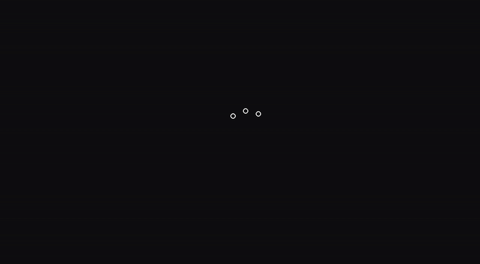
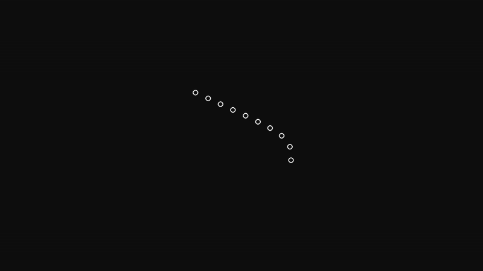
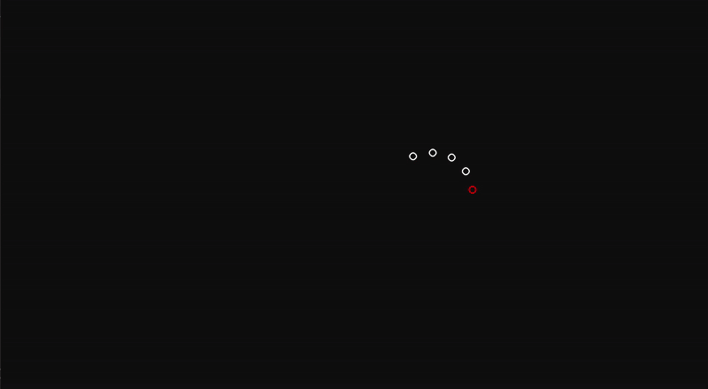
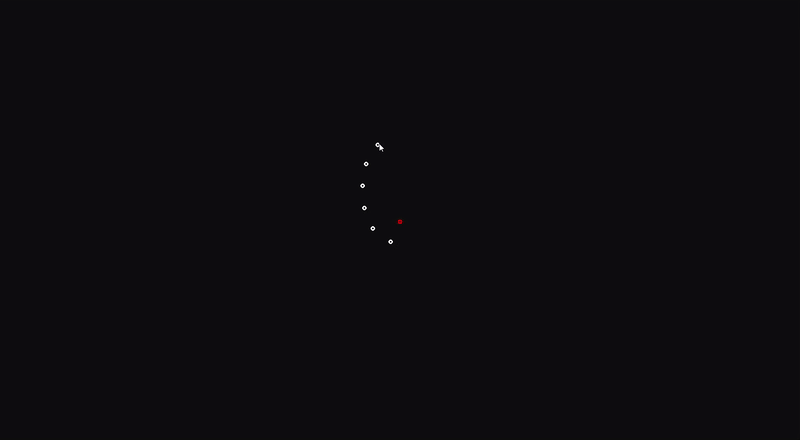
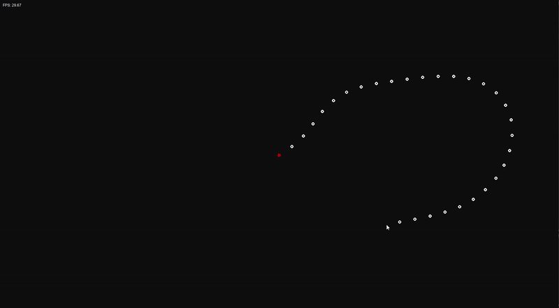
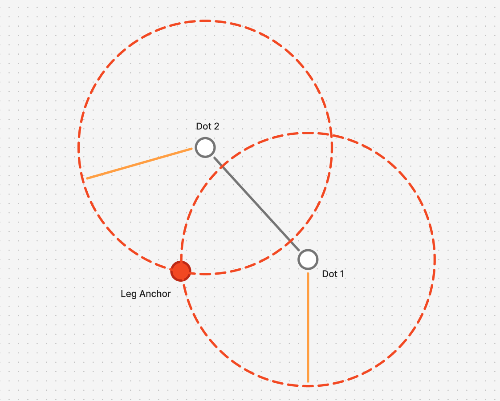
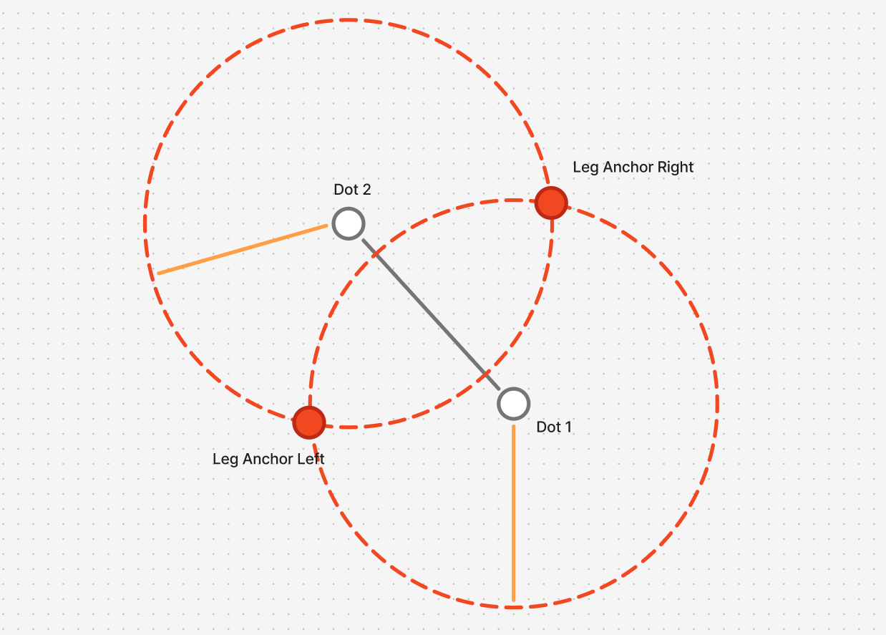
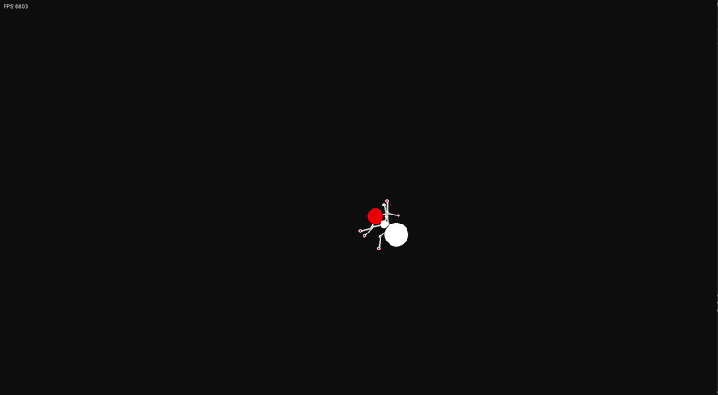
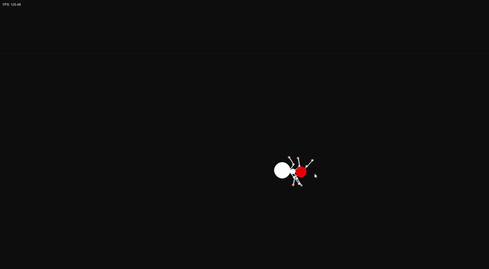

# Dev Log: Procedural Animation

## The Theory
After looking it at too much rainworld content I have become very obsessed with the idea of procedural animation and specifically locomotion that isn't predefined with sprites. Hence, I will be exploring the ideas of procedural animation, hopefully making some cool things along the way!

I want to start with making a snake/worm like creature using the basic ideas of procedural animation and chained contraints. From there I want to try and make legs which move realistically and then finally make an ant which can move aroundthe environment, turning and walking and living life.

## Log 1: Understanding Procedural Animation

The lovely argonaut created a video discussing the basic technique of procedural animation[^1] - specifically starting with chained contraints which seem to be able to do most of what I need to for the first snake. I essentially needed to make a linked-list-style structure where each point on the object is connected to the one infront of it as a parent with a certain distance contraint. There should also be a main anchor which does all the movement and all the other points follow through the constraints.

I started by creating a basic world that the procedurally animated snake will run in using a default pygame environment from previous projects. Next, it was time to create the data structure that will hold the information for the procedurally animated line (for speed, it will be called a skeleton).

```python
class Dot:
    def __init__(self, id):
        self.id = 1 # Position in the dot list
        self.child = None
    
    def add_child(self, child):
        """Assign a child to this dot object"""
        self.child = child
```

I am of course still figuring out what will need to be done for this but at this very moment I think this should be enough to just create the structure. From there, I then setup a class which will hold all the dots in a skeleton so that mass updates can be performed:

```python
from Dot import Dot

class Skeleton:
    def __init__(self, length):
        self.length = length    # Length of the skeleton
        self.anchor = None      # The dot that is moved around

        self.setup_skeleton()

    def setup_skeleton(self):
        """Setup the full skeleton"""
        self.anchor = Dot(0)
        current_dot = self.anchor

        for id in range(1, self.length):
            current_dot.add_child(Dot(id))
        
        print(self.anchor.child != None)
```

Once again, this will be updated as I find out what does and doesn't work.

An interesting thing I immediately noticed was how similar it was to linked lists, especially the setup of the skeleton where we loop through, adding a child to dots then making the current dot the new dot. Upon some more research I found out that you can actually define types for class attributes before the `__init__()` function which is very helpful. With this, I updated the skeleton code to look like this:

```python
class Skeleton:
    # Defining parameters
    length: int             # Length of the skeleton
    anchor: 'Dot | None'    # The dot that is moved around

    def __init__(self, length):
        self.length = length    
        self.anchor = None      

        self.setup_skeleton()

    def setup_skeleton(self):
        """Setup the full skeleton"""
        self.anchor = Dot(0)
        current_dot = self.anchor

        for id in range(1, self.length):
            current_dot.add_child(Dot(id))
            current_dot = current_dot.child
```

..and my Dot code to be this:

```python
class Dot:
    id: int             # Position in the dot list
    child: 'Dot | None' # Child dot of this object

    def __init__(self, id):
        self.id = id 
        self.child = None
    
    def add_child(self, child):
        """Assign a child to this dot object"""
        self.child = child
```

This just means that even if I am multiple child objects into interating, I will still get the functions that a particular dot has as the type of the `child` object is known.

With this, I now wanted to create the distances between different dots. My current thinking is that the skeleton will have uniform distances between dots and that distance will be passed into the dots. Each dot will also track it's position and when constraining it's child dot, it will use it's position and adjust the child based on that (poorly explained but I'm figuring this one out myself).

```python
class Dot:
    id: int             # Position in the dot list
    child: 'Dot | None' # Child dot of this object
    dist: int           # Distance to constrain child to
    position: pygame.Vector2 # Current position of the dot

    def __init__(self, id, dist, pos):
        self.id = id 
        self.child = None
        self.dist = dist
        self.position = pos
```

With this I also changed the `Skeleton` code:

```python
class Skeleton:
    # Defining parameters
    length: int             # Length of the skeleton
    anchor: 'Dot | None'    # The dot that is moved around
    dot_dist: int

    def __init__(self, length, dist):
        self.length = length    
        self.anchor = None      
        self.dot_dist = dist

        self.setup_skeleton()

    def setup_skeleton(self):
        """Setup the full skeleton"""
        self.anchor = Dot(0, self.dot_dist, pygame.Vector2(0, 0))
        current_dot = self.anchor

        for id in range(1, self.length):
            current_dot.add_child(Dot(id, self.dot_dist, pygame.Vector2(current_dot.position.x + self.dot_dist, 0)))
            current_dot = current_dot.child
```

Just to add, because this is essentially a linked list, it allows for easy debugging just in the console without needing to have things showing on screen just yet. For example, to test that this functionality is working I wrote a simple linked-list traversal program to print the position of each dot:

```python
if __name__ == "__main__":
    skeleton = Skeleton(3, 50)
    current_dot = skeleton.anchor

    while current_dot != None:
        print(current_dot.position)
        current_dot = current_dot.child
```

This prints out "[0, 0] [50, 0] [100, 0]" which is exactly what we want to see. What I now want to do is move this into a constrain function rather than have the skeleton do it so we can get started on that piece of the functionality.

```python
def constrain_child(self):
    """Constrain the child to be in the radius defined in the skeleton"""
    self.child.position = self.position + pygame.Vector2(self.dist, 0)
```

Very basic functionality but it works so we can stick with it for now.

Next is to draw these dots to the screen which should be quite easy:

```python
def draw(self, screen):
    current_dot = self.anchor

    while current_dot != None:
        pygame.draw.circle(screen, (255, 255, 255), current_dot.position, 5, 3)
        current_dot = current_dot.child
```

And with this we can see our circles on the screen!

## Log 2: Stepping the skeleton

Next thing I want to do is add a simple stepping algorithm to have the skeleton start to move around so we can then begin implementing a more robust constraint system. This starts by tracking the position and velocity of the skeleton, using the anchor point at the main point for these values. We then need a step function which does the movement and constraint calculations.

For now the simulation will have default value for velocity simply so we can get things working.

The main problem here is figuring out what direction to move a child dot when constraining. My first thought is to get the vector going from the parent dot to the child directly, normalize the vector and then ensure it's magnitude is equal to the distance defined in the skeleton (call this final vector v_constraint), then move the child dot to `parent.position + v_constraint`. I will try this and see what we get first.

```python
    def constrain_child(self):
        """Constrain the child to be in the radius defined in the skeleton"""

        # Check if the dot has a child
        if self.child == None:
            return

        # Calculate vector going from parent to child
        direction_vector = self.child.position - self.position

        # Get normalised direction vector and multiply it by distance between points
        direction_vector = direction_vector.normalize() * self.dist

        # Move child to current position + direction vector
        self.child.position = self.position + direction_vector
```

This did seem to work and we got a moving little snake! But I couldn't be confident it worked until I saw the constraints properly working i.e. working on a snake dynamically moving. Hence, I wanted to implement some way of making the snake move in the circle. For this, I think parametric equations fit quite nicely.

```python
    def step(self):
        # velocity = pygame.Vector2(math.cos(self.current_angle)*3, math.sin(self.current_angle)*3)
        # self.current_angle = (self.current_angle + 5) % 360

        # self.anchor.position += velocity
    
        center = pygame.Vector2(self.dimensions.x / 2, self.dimensions.y / 2)
        radius = 100
        self.current_angle = (self.current_angle + 0.05) % (2 * math.pi)

        # Update anchor position
        self.anchor.position.x = center.x + radius * math.cos(self.current_angle)
        self.anchor.position.y = center.y + radius * math.sin(self.current_angle)

        # Loop through all dots and constrain them
        current_dot = self.anchor
        
        while current_dot != None:
            current_dot.constrain_child()
            current_dot = current_dot.child
```

And we get this:

<div align="center">
    
    <p><em>Figure 2: First procedural animation!</em></p>
</div>

Like!!! I was initially sceptical based on the fact all the code was based on notions in my head but this works much better than I expected! I also wanted to increase the radius and the length of the skeleton to see if the same quality of animation holds up.

<div align="center">
    
    <p><em>Figure 3: Larger circular movement</em></p>
</div>

Beautiful. A very cool thing you can see at the start of the gif is the way to body slowly curls into the main circle as it becomes constrained and forced to follow the rest of the body. With this we have a very good starting point!

## Log 3: Angle constraints

Next thing to implement is the angle constraints: This is essentially stopping the skeleton from being able to fold in on itself as it moving. The easiest way to implement this in my head (and according to the video) is to calculate the angle being made between the current dot and the 2nd child of the dot. If this angle is greater than the maximum angle then we snap the child of the child back to the maximum angle.

While thinking about this implementation I realised I'll probably need to do this calculation backwards i.e. when checking a dot we look at the parent's parent and calculate the angle. For this we need to switch our linked list to be a doubly linked list (i.e. you can traverse backwards and forwards) or include another iterator. I think for this case it would be easier to just convert it to a doubly linked list.

```python
class Dot:
    id: int # Position in the dot list
    child: 'Dot | None' # Child dot of this object
    parent: 'Dot | None' # Child dot of this object
    dist: int # Distance to constrain child to
    position: pygame.Vector2 # Current position of the dot
```

Next, it was time to implement the angle constraint function. This was actually a lot more difficult than I thought but it was also down to me being quite silly. The main error I encountered was a lack of knowledge regarding the `math` trigonometry functions. 2 hours was spent figuring out why it wasn't working while not realising `math.cos()` and `math.sin()` take radian angles instead of degrees. Once I had figured this out the code ended up being:

```python
# Check if we have a grandparent (i guess?)
if self.parent != None and self.parent.parent != None:
    parent = self.parent.parent
    middle = self.parent

    # Calculate the 2 vectors
    parent_vec:pygame.Vector2 = parent.position - middle.position
    child_vec:pygame.Vector2 = self.position - middle.position

    # Calculate the angle between the two vectors
    angle = parent_vec.angle_to(child_vec)

    # If we are out of the angle threshold
    if abs(angle) < angle_thresh or abs(angle) > (360 - angle_thresh):

        norm_vec = parent_vec.normalize()

        set_angle = angle_thresh if angle < angle_thresh else (360 - angle_thresh)

        # Rotate the parent vector by the exact amount for the parent threshold
        new_vec = pygame.Vector2(
            norm_vec.x * math.cos(math.radians(set_angle)) - norm_vec.y * math.sin(math.radians(set_angle)),
            norm_vec.x * math.sin(math.radians(set_angle)) + norm_vec.y * math.cos(math.radians(set_angle))
        ) * self.dist

        # Set our position to be our parents position + the vector to get to the correct angle
        self.position = middle.position + new_vec
```

and we end up with this:

<div align="center">
    
    <p><em>Figure 4: Angle constraint with infinity movement</em></p>
</div>

I think that works very well and we are good to move onto the next thing - body segment sizes!

## Log 4: Body Size

This section should be quite an easy part of the process. For each circle in the body of the skeleton, we can define a size which the circle should be and when we draw it, we iterate through this list, using each size for each dot to create the shape of our animal (in our case an ant).

```python
# ...

self.dot_sizes = dot_sizes

# Checking to see if we have the same amount of sizes and dots
if not len(dot_sizes) == self.length:
    while len(dot_sizes) != self.length:
        # Add default dot size to pad the dot_sizes list
        dot_sizes.append(5)

# ...
```

I also added the padding check to make sure that we have a size for every single dot.

<div align="center">
    
    <p><em>Figure 5: Differing dot sizes</em></p>
</div>

This also lead me to realise it is probably good to add a size for each body segment as well so that you can have some dots closer together and some further apart. For this we would need a similar array and similar functionality so there isn't much complexity to this.

```python
# ...

self.dot_distances = dot_distances

# ...

def setup_skeleton(self):
    """Setup the full skeleton"""
    self.anchor = Dot(0, self.dot_distances[0], pygame.Vector2(self.dimensions.x / 2, self.dimensions.y / 2))
    previous_dot = None
    current_dot = self.anchor

    for id in range(1, self.length):
        current_dot.add_parent(previous_dot)
        current_dot.add_child(Dot(id, self.dot_distances[id], pygame.Vector2(0, 0)))

        previous_dot = current_dot
        current_dot = current_dot.child
```

And this is the result:

<div align="center">
    
    <p><em>Figure 6: Differing segment lengths</em></p>
</div>

I am very happy with this and I'm ready to move onto the next (and probably hardest) part - legs.

## FABRIK Legs

Unfortunately, legs are much more complicated than a body. While the dots within a body can simply be dragged along, legs must calculate where they need to go to get to the next point in the best way possible.

From research, the way this is done procedurally is through a process called **FABRIK**, or **Forward and backward reaching inverse kinematics**. In this process. A target position is given and the skeleton moves forwards and backwards from the target to it's anchor position, gradually converging to a configuration that allows the skeleton to reach to the point or as close to the point as possible while staying at it's anchor point.

From researching and looking at different posts (one especially helpful one for a starting point was this stack overflow post[^2]) the best best idea seemed to be to move the first node of the leg (this would be the foot) to the target position, then constrain all other notes before then moving the node connected to the body back to its anchor point and constraining all other nodes. This can be done for a set iteration count and then the final result is what is seen on the screen.

I did this in a separate python file as I think it is much easier to work on by itself.

Of course the entire leg class is a bit much to put here but essentially it is the same as the skeleton but with a few changes.

1. I now also track the end of the leg so I can do forward and backward movement without needing to iterate all the way to the end of the linked list just to get the "foot"

```python
def setup_leg(self):
    """Sets up all dots in the leg"""
    self.anchor = Dot(0, 50, pygame.Vector2(self.dimensions.x / 2, self.dimensions.y / 2))
    previous_dot = None
    current_dot = self.anchor

    for id in range(1, self.length):
        current_dot.add_parent(previous_dot)
        current_dot.add_child(Dot(id, 50, pygame.Vector2(0, 0)))

        previous_dot = current_dot
        current_dot = current_dot.child
    
    current_dot.child = None
    current_dot.parent = previous_dot
    self.endpoint = current_dot

    # Loop through all dots and constrain them
    current_dot:Dot = self.anchor
    
    while current_dot != None:
        current_dot.constrain_child(self.angle_thresh)
        current_dot = current_dot.child
```

I also need to constrain all dots in the setup of the leg as otherwise we get zero-vector errors in the fabrik function

2. Added the FABRIK function to the leg

```python
def step(self):
    """Steps the leg forward"""
    # Perform fabrik calculation
    self.fabrik()
    
def fabrik(self):
    """Performs the fabrik algorithm"""
    for _ in range(0, self.iterations):
        # Forward
        self.endpoint.position = self.target_point
        current_dot = self.endpoint
        while current_dot != None:
            current_dot.constrain_parent(self.angle_thresh)
            current_dot = current_dot.parent
        
        # Backward
        self.anchor.position = self.anchor_point
        current_dot = self.anchor
        while current_dot != None:
            current_dot.constrain_child(self.angle_thresh)
            current_dot = current_dot.child
```

I did also implement a `constrain_parent()` function but just imagine the `constrain_child()` function with the child and parent switched.

I currently have the number of iterations set to 30 but I'm tweaking to see what happens. A side note to explain something else I implemented just to make sure things are setup correctly is a way of printing out the current configuration of a skeleton, dot or leg:

```python
# In Leg and Skeleton class
def __str__(self):
    string = ""

    current_dot = self.anchor
    
    while current_dot != None:
        string += current_dot.__str__() + "\n"
        current_dot = current_dot.child
    
    string += f"endpoint: {self.endpoint} \n"
    
    return string
```

...and in the Dot class

```python
def __str__(self):
    return f"""
    id: {self.id}
    parent: {None if self.parent == None else self.parent.id}
    child: {None if self.child == None else self.child.id}
    """
```

This makes it very easy to see if the linked lists are set up correctly which is always nice (work hard so you don't have to work hard).

With all this implemented, I also quickly added a check for the current mouse position and set the target position of the leg (I guess it is an arm for now) to that point. That leads to this:

<div align="center">
    
    <p><em>Figure 7: FABRIK arm</em></p>
</div>

I currently have the angle constraints set to 0 because you get some very weird movements when you fold the arm in on itself.

One thing that did really surprise me was just how efficient the algorithm seemed to be working - so of course I pushed the algorithm to the max. But even running 500 iterations per step with 30 dots in the leg, the simulation ran at a constant 30 frames per second:

<div align="center">
    
    <p><em>Figure 8: FABRIK performance test</em></p>
</div>

Of course all we need are enough joins for an ant which are 3 + the foot so 4 dots so running this simulation with 500 iterations is more than viable. If performance did become an issue especially when using this in larger simulations with multiple ants, An idea I had was to switch from a linked list structure to a dictionary data structure however currently we are already only in O(n) time as you only need to iterate up and down the list so I'm not sure how much improvement that will give.

Next thing to implement is the anchoring to the body. We need to have a way of creating a point on the body that will stay in the same place relative to the body at all times. This one did require quite a bit of thought as it isn't enough to just add another dot to the skeleton and let it move (if we were working in Unity it would be that easy). The first way I can think of is to add the anchor point as a child to neighbouring parts of the skeleton and constrain it based on the positions of all those dots. To illustrate:

<div align="center">
    
    <p><em>Figure 9: Leg anchor idea</em></p>
</div>

What we do here is calculate the intersection of the two circles around the 2 skeletal dots. We would need to figure out which intersection to pick (as there are 2 when circles intersect unless it is tangential) but in this simulation ants are going to be symmetrical meaning i can just use both interestions to create 2 anchor points in one!

<div align="center">
    
    <p><em>Figure 10: Two leg anchor</em></p>
</div>

The other idea is to just use the points in the skeleton as anchors for the dots which is SO much easier and will be what I do for now.

When it comes to creating target points my idea is to use the vectors between points. I can calculate the vector between 2 skeletal points and get the perpendicular vector to it. That will then give me the direction to move along to place the target point.

This couldn't have been a harder task. ChatGPT was no help despite being upgraded to 5.0 which is exactly what you like to hear for the advancement of GAI but I resorted to the best neural network of them all - ma brain - and thought of a few things.

1. I could get a point slightly infront or behind an anchor in relation to the body of the ant by adding or subtracting the direction vector from the anchor position.
2. I needed to add velocity to the feet of the legs as they were going to just teleport to their next target point

This required a lot of refactoring and a lot of code - a lot of worry that i should've committed the code before making a change - but the result was more than good.

First I implemented the anchor points and each of the legs (currently done separately just to make it easier for me to understand when programming and I will optimise next):

```python
def __init__(self, dimensions):
    self.dimensions = pygame.Vector2(
        dimensions[0],
        dimensions[1]
    )

    self.skeleton = Skeleton(3, (self.dimensions.x, self.dimensions.y), 110, [20, 10, 30], [30, 40, 0])
    
    self.left_front = Leg(3, (self.dimensions.x, self.dimensions.y), 20)
    self.left_middle = Leg(3, (self.dimensions.x, self.dimensions.y), 20)
    self.left_back = Leg(3, (self.dimensions.x, self.dimensions.y), 20)

    self.right_front = Leg(3, (self.dimensions.x, self.dimensions.y), 20)
    self.right_middle = Leg(3, (self.dimensions.x, self.dimensions.y), 20)
    self.right_back = Leg(3, (self.dimensions.x, self.dimensions.y), 20)

    self.skeleton.step()

    self.leg_anchor_points = [
        self.skeleton.anchor.position,
        self.skeleton.anchor.child.position,
    ]

    self.setup_ant()

def setup_ant(self):
    """Sets up all elements of the ant"""
    self.right_front.anchor_point = self.leg_anchor_points[0]
    self.left_front.anchor_point = self.leg_anchor_points[0]

    self.right_middle.anchor_point = self.leg_anchor_points[1]
    self.left_middle.anchor_point = self.leg_anchor_points[1]

    self.right_back.anchor_point = self.leg_anchor_points[1]
    self.left_back.anchor_point = self.leg_anchor_points[1]
```

From here I then created 3 functions to step forward the front set, middle set and back set of legs. They are all very similar which should hopefully make optimisation quite easy:

```python
def step_front_legs(self):
    """Sets the front legs target position and moves the front legs"""
    # Step the front left and right legs

    point_1 = self.skeleton.anchor.position
    point_2 = self.skeleton.anchor.child.position

    # Get vector for those two
    dir_vector = (point_2 - point_1).normalize()
    
    # Rotate the parent vector by the exact amount for the parent threshold
    new_vec = pygame.Vector2(
        dir_vector.x * math.cos(math.radians(-90)) - dir_vector.y * math.sin(math.radians(-90)),
        dir_vector.x * math.sin(math.radians(-90)) + dir_vector.y * math.cos(math.radians(-90))
    ) * 50

    new_left_vec = new_vec - (dir_vector * 50)
    new_right_vec = (new_vec * -1) - (dir_vector * 50)

    left_target_point = self.leg_anchor_points[0] + new_left_vec
    right_target_point = self.leg_anchor_points[0] + new_right_vec

    if self.left_front.target_point.distance_to(left_target_point) > 80:
        self.left_front.set_target_point(left_target_point)
    
    if self.right_front.target_point.distance_to(right_target_point) > 80:
        self.right_front.set_target_point(right_target_point)

    self.left_front.step()
    self.right_front.step()
```

There also needed to be some tweaks to the `Leg` class to have the legs move rather than just teleport. The easiest way to do this (in my humble opinion) is to have a `target_point` variable and a `current_target_point` variable. When we change the target position in the Ant class, we call a function in the leg to say that we should begin accelerating our leg in the direction of the new target point. We can then move the current target point linearly from it's current position to the position of the target point, accelerating it along the direction vector to the new target position.

While implementing this, I had a problem of the current target position never settling as it was never exactly on the target position, so I also included a maximum number of moving steps a leg can make and after that amount of steps the leg will stop moving and snap to the final target position.

```python
def set_target_point(self, point: pygame.Vector2):
    """Change the target point of the leg"""
    self.target_point = point
    self.on_target_point_changed()

def on_target_point_changed(self):
    """Event function for when the target point is changed"""
    self.target_point_moving = True
    
def move_target_point(self):
    """Move the current target point linearly towards the new target position"""
    # Get direction to next point
    if self.target_point.distance_to(self.current_target_point) < 5 or self.steps_moving == 10:
        self.target_point_moving = False
        self.steps_moving = 0
        self.current_target_point = self.target_point

        self.velocity = pygame.Vector2(0, 0)
        return

    dir = (self.target_point - self.current_target_point).normalize()
    self.velocity = self.velocity + pygame.Vector2(self.acceleration * dir.x, self.acceleration * dir.y)
    self.current_target_point += self.velocity
```

And with all this implemented plus some other small bug fixes, we get this:

<div align="center">
    
    <p><em>Figure 11: First ant!!!</em></p>
</div>

Honestly I could just end it here because of how crazy it is to think that I programmed that basically ant looking thing to move as it is now but I know I can make the simulation run and move better.

I quickly changed the number of iterations for the FABRIK algorithm down to 50 from 500 and went from around 70 fps to around 110 which was great. I then for fun decided to include a similar mouse finding algorithm to the leg test script in the ant script, producing this:

```python
# In constructor...

self.target_position = pygame.Vector2(self.dimensions.x, self.dimensions.y)
self.velocity = pygame.Vector2(0, 0)
self.acceleration = 2
self.max_velocity = 3
self.moving = False
```

And then some functions for setting a target position and moving:

```python
def set_target_position(self, position: pygame.Vector2):
    self.target_position = pygame.Vector2(position[0], position[1])
    self.moving = True

def step(self):
    if self.moving:
        print(abs(self.target_position.distance_to(self.skeleton.anchor.position)))
        if abs(self.target_position.distance_to(self.skeleton.anchor.position)) < 50:
            self.moving = False
        else:
            dir = (self.target_position - self.skeleton.anchor.position).normalize()

            self.velocity += dir * self.acceleration

            if self.velocity.magnitude() > self.max_velocity:
                self.velocity = self.velocity.normalize() * self.max_velocity
            
            self.skeleton.anchor.position += self.velocity

    # ...
```

All of that gives us this:

<div align="center">
    
    <p><em>Figure 12: Ant Mouse Movement</em></p>
</div>

If that isn't a successful log I don't know what is honestly.

[^1]: [Argonaut's "A simple procedural animation technique"](https://www.youtube.com/watch?v=qlfh_rv6khY)
[^2]: [FABRIK IK algorithm query](https://stackoverflow.com/questions/72883753/how-to-implement-fabrik-algorithm-inverse-kinematics-with-joint-angle-constrai)